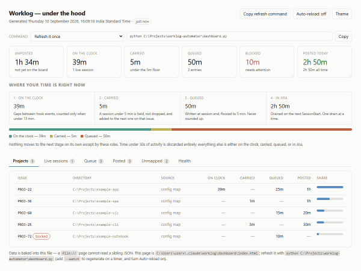

# Technical Documentation

> **Version:** 0.2.0
> **Audience:** anyone changing this code. For using the tool, read
> [USER_MANUAL.md](USER_MANUAL.md).

---

## 1. What the system does

Claude Code fires hooks at session boundaries and on activity. `worklog.py`
turns those into an accumulating measure of *active* time per Jira issue, and
writes a rounded worklog entry to a local queue at session end. `post.py` drains
that queue into Jira's REST v3 worklog API.

The two halves are deliberately separate processes with a file between them.
SessionEnd hooks share a short budget in Claude Code, so the hook path does local
file I/O only — no network, no `gh`, no git call that can hang. Everything that
can block happens later, in `post.py`.

```
 Claude Code hooks                  worklog.py                    post.py
 ─────────────────                  ──────────                    ───────
 SessionStart      ──▶ session-start ─▶ sessions/<id>.json
 UserPromptSubmit  ──┐
 PostToolUse       ──┼▶ activity     ─▶ accumulate active_seconds
 Stop              ──┘
 SessionEnd        ──▶ session-end   ─▶ finalize_record()
                                          │
                                          ├─▶ carry.json      (below the floor)
                                          ├─▶ unmapped.jsonl  (no issue key)
                                          └─▶ queue.jsonl     (a real worklog)
                                                     │
 SessionStart      ─────────────────────────────────┴─▶ post.py run --from-hook
                                                              │
                                                              ├─▶ Jira REST v3
                                                              └─▶ posted.jsonl
```

Planyway has no API and no custom fields of its own — it renders native Jira time
tracking. `adjustEstimate=auto` on the worklog POST is what moves the remaining
estimate and therefore what makes the Planyway timeline move.

---

## 2. Why active time, not wall clock

A session left open overnight would log fourteen hours. Instead, each activity
hook measures the gap since the last one and counts it **only if it is under
`idle_timeout_minutes`** (default 15). A longer gap increments `idle_drops` and
counts nothing.

This means the measure is a lower bound on real work — thinking time between
tool calls counts, but a lunch break does not. That bias is deliberate: it is
better to under-report than to invent.

`SessionEnd` does not fire if the terminal is killed, so `SessionStart` runs
`sweep_stale()`, which finalizes any session file whose `last_activity` is older
than `stale_session_hours` (default 12) with `reason="stale"`. Stale finalization
skips git context collection, because the repository may have moved on.

---

## 3. State files

All under the **state directory**: `~/.claude/worklog/`, or `$CLAUDE_WORKLOG_DIR`
if set. None of it is in the repository.

| File | Written by | Holds |
|---|---|---|
| `config.json` | `worklog.py` | Settings and the central project → issue map |
| `sessions/<id>.json` | `worklog.py` | One live session; deleted at session end |
| `carry.json` | `worklog.py` | Per-issue sub-minimum balance carried forward |
| `queue.jsonl` | both | Worklogs waiting to be posted. **The source of truth for unposted time.** |
| `unmapped.jsonl` | `worklog.py` | Sessions in directories with no issue key |
| `posted.jsonl` | `post.py` | Archive of everything successfully posted |
| `credentials.json` | user | `base_url`, `email`, `api_token`. Never committed. |
| `github-titles.json` | `post.py` | Cache of resolved GitHub issue titles |
| `worklog.log` | both | Append-only diagnostic log |
| `post-run.lock` | `post.py` | Held for the duration of a drain; see *Concurrency* |

`queue.jsonl`, `carry.json` and the other shared files are guarded by `FileLock`,
a lock-directory-style mutex built on `os.open(..., O_CREAT | O_EXCL)` — portable
to Windows, unlike `fcntl`. A lock older than `stale_after` (30s by default) is
assumed abandoned by a killed process and broken. The drain lock overrides that
to 900s, because breaking a lock whose holder is still working is worse than
having no lock at all.

---

## 4. The queue entry

The contract between the two scripts. Changing this shape means changing both.

```json
{
  "id": "57ec626f87f943f0a1455f095a2a5b8a",
  "issue_key": "PROJ-67",
  "time_spent_seconds": 300,
  "started": "2026-09-04T07:42:13.302+0530",
  "comment": "userx/worklog-automator#1 | 1 commit: db09dad ... | logged automatically from Claude Code",
  "comment_parts": {
    "repo": "worklog-automator",
    "branch": "fix/gh-1-duplicate-check",
    "github_repo": "userx/worklog-automator",
    "github_issue": 1,
    "commits": ["db09dad README: document how to run the post.py test suite"],
    "carried_seconds": 271.6,
    "session_seconds": 101.6,
    "idle_drops": 0,
    "end_reason": "clear"
  },
  "session_id": "real-lifecycle-074213",
  "created": "2026-09-04T07:43:54.867926+05:30",
  "status": "pending"
}
```

Fields added by `post.py` as an entry progresses: `attempts`, `last_error`,
`last_attempt`, `next_attempt`, `jira_worklog_id`, `posted_at`, `adopted`.

**`started` uses Jira's format** — `%Y-%m-%dT%H:%M:%S.mmm%z`, milliseconds
required, **no colon in the offset** (`+0530`, not `+05:30`). `started_to_ms()`
normalises both forms to the same epoch millisecond, which matters because
duplicate adoption compares timestamps.

**`comment` versus `comment_parts`.** The comment is rendered at session end from
the parts, without the GitHub issue *title* — resolving that needs a network call
the hook cannot afford. `post.py` resolves the title at post time and re-renders.
`worklog.render_comment()` is the single source of truth for the format; nothing
else builds this string.

### Status values

| Status | Meaning |
|---|---|
| `pending` | Never attempted |
| `failed` | Transient failure; `next_attempt` says when to try again |
| `blocked` | Permanent failure, or the attempt cap. Needs a human. |
| `posted` | In Jira. Moved to `posted.jsonl` and out of the queue. |

---

## 5. Issue key resolution

In order, first match wins (`worklog.resolve_issue`):

1. **`$CLAUDE_WORKLOG_ISSUE`** — an override for one session.
2. **`.jira-project` marker**, walking *up* from the working directory. Accepts a
   bare key (`PROJ-67`) or `key: value` lines, including `github: owner/repo`.
3. **Central map** in `config.json` under `projects`, **longest matching path
   prefix wins**.

Unresolved sessions are not dropped — they go to `unmapped.jsonl` with a hint,
which doubles as a ranked list of directories worth mapping.

Two consequences worth knowing:

- A marker **beats** the central map, so `unmap` alone will not stop tracking a
  directory that has one. `cmd_unmap` warns when this is the case, walking up
  parents the same way resolution does.
- The walk goes **up**, so a marker at a parent directory captures every project
  beneath it.

### GitHub context

`collect_git_context()` runs at session start and end only, with 2-second
timeouts, and fails soft. It reads the branch, the `origin` remote slug, and
commits since the session started. `github_issue_from_branch()` extracts an issue
number from branch names like `fix/gh-1-...`, `issue-42-...` or `1-...`.

---

## 6. Rounding, the carry balance, and the retry model

### Rounding

At session end (`finalize_record`):

1. Below **30 seconds** of active time: nothing is recorded at all.
2. `balance = carry.get(issue) + active`
3. If `balance < max(minimum_minutes, round_to_minutes)`: store the whole balance
   as carry and emit nothing.
4. Otherwise `rounded = floor(balance / round_to) * round_to`, and the leftover
   carries forward if it is ≥ 30 seconds.

**Floor, never round-to-nearest.** Rounding up invents time that was never
worked. The remainder carries, so nothing is lost either — five 3-minute sessions
become one 15-minute worklog rather than noise or five zeros.

The minimum is judged on the **accumulated** balance, not the rounded figure,
otherwise a 3-minute session rounds to 5 and defeats the point of the minimum.

### Retry classification

```python
RETRY_STATUS    = {408, 409, 429, 500, 502, 503, 504}
BACKOFF_SECONDS = [60, 300, 900, 3600, 3*3600, 6*3600]   # then repeats the last
MAX_ATTEMPTS    = 24
```

- **Transient** — anything in `RETRY_STATUS`, plus every network-level failure
  (timeout, DNS, TLS, offline), which carry `status=None`. These back off.
- **Permanent** — everything else: 401, 403, 404, 400. These block immediately.
  Retrying will not fix a bad credential or a deleted issue, and a queue that
  retries forever is a queue nobody reads.
- At `MAX_ATTEMPTS` a transient failure becomes `blocked`, so it stops being
  invisible.

**Known deviation:** Jira's `Retry-After` header on a 429 is ignored in favour of
the fixed ladder, so a server asking for 120 seconds is retried at 60 and earns
another 429. Not data-losing. Recorded as a note in `tests/test_post.py` rather
than a failure, and open on PROJ-67.

### Duplicate adoption

A request can succeed and still fail to return — a client-side timeout says
nothing about the server side. So **any entry with `attempts > 0` is checked
against Jira before it is retried**. `find_existing()` matches on issue, author
account id, exact duration, and start time within one second, searching from
`started - 2s`. A match is *adopted*: the entry is marked posted with the
existing worklog's id and `adopted: true`, and no second POST is made.

The subtle part, and the bug this cost: **a failed lookup must not be
indistinguishable from a clean miss.** `find_existing` raises rather than
returning `None` when the lookup itself fails, and the caller parks the entry —
backing off if transient, blocking if not. Posting on an unknown is precisely how
you get two worklogs for one session, and it is reachable exactly when it matters
most: on a retry after a rough patch, when the next call is also likely to fail.

### Concurrency: one drain at a time

`post.py run` takes an exclusive lock (`post-run.lock` in the state directory)
for the whole read → post → write cycle. A second drain that cannot get it
**exits immediately** rather than waiting, because it has nothing to add.

This is not theoretical. Reopening the desktop app started three sessions at
once; every `SessionStart` fires the drain hook; all three read the same pending
entry and posted it, putting one 10-minute session on the board three times
(worklogs 10041/10042/10043, all `created` in the same second, all `attempts=0`).

**Duplicate adoption does not cover this case.** It is gated on `attempts > 0`,
which defends against a *sequential* retry after a failure. In a race every
process holds a fresh entry at `attempts == 0`, so none of them looks first. The
lock is the only thing standing between concurrent hooks and duplicate worklogs.

`--dry-run` skips the lock: it makes no request and changes nothing, so it must
never be refused because a real drain is running.

The lock's `stale_after` is 900s, far longer than any plausible drain. A lock
broken while its holder is still working is worse than no lock, because both
processes then believe they hold it.

### Ordering on success

`archive(done)` runs **before** `save_queue(remaining)`. Dropping an entry from
the queue before its record is durable loses the evidence that time was ever
logged; the other order can only ever re-read an entry next run, where the
duplicate check adopts it.

---

## 6a. Session lifecycle: what banks time and what does not

Time is only turned into a queue entry by `finalize_record()`, which runs from
exactly two places: `end_session()` (the SessionEnd hook) and `sweep_stale()`
(from SessionStart, for orphans past the cutoff). Everything else leaves the
clock running.

Claude Code's documented triggers, and what each does. Measured, not assumed —
`tests/test_session_lifecycle.py` asserts every row.

| Route | Hooks fired | `finalize_record` | Clock after |
|---|---|---|---|
| `/clear` | SessionEnd(`clear`) → SessionStart(`clear`) | yes | 0 |
| `/resume` | SessionEnd(`resume`) → SessionStart(`resume`) | yes | 0 |
| Quit / log out | SessionEnd(`logout` \| `prompt_input_exit` \| `other`) | yes | 0 |
| `/compact` | SessionStart(`compact`) only | **no** | unchanged |
| Fork | SessionStart(`fork`) only | **no** | unchanged |
| Force-kill, restarted inside the cutoff | SessionStart(`startup`) | **no** | unchanged, `resumed` incremented |
| Force-kill, restarted past the cutoff | SessionStart(`startup`) → `sweep_stale` | yes, `reason="stale"` | 0 |

**The invariant:** no route loses time. Every second is queued, carried, or still
on the clock. `test_no_path_loses_time` checks this across all seven.

### Why `/compact` is the trap

It fires SessionStart without SessionEnd. `post.py run --from-hook` is registered
on SessionStart, so a compaction **drains an existing queue** — which looks like
the tool working — while the current session's accumulated time is never
finalized. The easy misreading is that compaction banks your time. It does not.

### The `resume` inconsistency

`start_session()` has a branch for an existing session record:

```python
if path.exists():  # resume / fork: keep accumulated time, just re-arm the clock
    record["resumed"] = record.get("resumed", 0) + 1
```

Its comment says `resume`, but that path **cannot** fire on a real resume:
`end_session()` unlinks the record unconditionally in a `finally`, whatever the
reason, so by the time SessionStart(`resume`) arrives there is nothing to find.
The branch fires for `fork`, `compact`, and a restart inside the stale cutoff —
which the tests pin down: `resumed == 1` after a same-day restart, and `resumed`
absent after a resume.

Consequence: a long conversation that is suspended and resumed produces **two**
worklogs rather than one. No time is lost, and sub-minimum fragments carry
forward, but the board reads differently. Whether that is a defect depends on
whether a resumed session should count as one continuous stretch — a product
decision, not a code one. Left as-is deliberately, and tested as-is so a change
is a visible change.

### Banking time without ending the conversation

The only route that keeps the conversation in place is sending the SessionEnd
hook by hand:

```bash
echo '{"session_id":"<id>","cwd":"<path>","reason":"manual-flush"}' | python worklog.py hook session-end
```

`end_session` finalizes and unlinks the record; the next activity hook finds no
record and calls `start_session`, so tracking resumes from zero with no double
count. There is no first-class command for this — a `worklog.py flush` that
finalizes in place would be the obvious addition.

## 7. Command reference

### `worklog.py`

| Command | Effect |
|---|---|
| `install` | Writes five hook handlers into `~/.claude/settings.json`, replacing any previous install of its own |
| `hook <event>` | `session-start` \| `activity` \| `session-end`; reads a JSON payload on stdin |
| `status` | Active sessions, carry balances, today's total |
| `queue [--json]` | Pending worklogs |
| `resolve [path]` | Explains issue-key resolution for a path |
| `map <path> <KEY> [slug]` | Adds a central mapping; path is resolved to absolute |
| `unmap <path>` | Removes one; exits 1 if absent; warns if a marker still captures the path |
| `doctor` | Checks hooks, config, runtime |

### `post.py`

| Command | Effect |
|---|---|
| `run [--dry-run] [--limit N] [--force] [--from-hook]` | Drains due entries |
| `check` | Verifies credentials, then GETs every queued issue key. Read-only. |
| `status` | Queue health, with the reason for each blocked entry |
| `retry <id-prefix\|all>` | Resets status to pending, clears backoff and attempts |
| `install-hook` | Registers `run --from-hook` on SessionStart, async |

### `dashboard.py`

| Command | Effect |
|---|---|
| *(no args)* | Writes `<state>/dashboard/index.html` |
| `--open` | ...and opens it in the browser |
| `--output <path>` | Writes elsewhere |
| `--watch [seconds]` | Regenerates on a timer (default 30) |
| `--serve [port]` | Serves on `127.0.0.1` (default 8777), regenerating on every load |

**The Refresh button has two behaviours, chosen at runtime from
`location.protocol`.** Served over http it calls `/regenerate` and reloads. From
a `file://` page it cannot: a browser cannot launch a process, and no amount of
JavaScript changes that. There it copies the command to the clipboard instead —
`navigator.clipboard` with a `document.execCommand` fallback, since the
clipboard API is not available in every `file://` context.



`tools/make_demo_gif.py` regenerates that GIF: thirteen frames walking every
tab, five states of the command picker (including the one styled as dangerous),
and dark mode. Frames come from headless Chromium — Edge or Chrome, whichever is installed, nothing downloaded — driven
over variant HTML files that pre-select a tab and theme. Assembly is standard
library only: a PNG reader on `zlib`, a box-average downscale, a median-cut
quantiser building one palette shared across all frames so colours cannot shift
mid-animation, and a GIF89a writer with its own LZW encoder.

Each frame's state is set **directly** rather than by dispatching `change` on
the picker: a real change event fires a clipboard write, which cannot succeed
headlessly and leaves the button reading "Selected — press Ctrl-C", wrapping it
onto a second line and shifting the layout mid-animation. Deliberately no
Pillow, ffmpeg or `node_modules`, for the same reason the rest of the project has
no dependencies.

**The command picker** (`command_menu()`) is built in Python, not JavaScript, so
every command carries a resolved absolute path and runs from any working
directory. Entries marked `danger` are the ones that write to Jira; the page
styles them red and appends a warning to the label. Clipboard writes need a user
gesture and a permitted context, and neither is guaranteed on `file://` — so a
failed copy selects the text and says to press Ctrl-C rather than reporting a
dead end.

**The refresh command is per-file.** `collect()` takes the output path so the
command it embeds includes `--output` whenever the page is not the default one.
Without that it printed a bare `python dashboard.py`, which rewrites the default
file — running it from a page in another directory looked exactly like a refresh
that did nothing. `test_dashboard.py` pins this by running the printed command
and asserting *that* page's timestamp advanced.

`--serve` binds to `127.0.0.1` only, never `0.0.0.0`. The page carries directory
paths, issue keys and Jira worklog ids; none of that belongs on the LAN.

Read-only: it never writes to the queue, the carry file or Jira. The data is
**embedded in the HTML** rather than loaded from a sibling JSON, because a
`file://` page cannot fetch a sibling file — CORS forbids it, which is the whole
reason a "static dashboard" usually needs a server. Baking the data in removes
that need. The cost is that refreshing means regenerating; `--watch` plus the
page's own auto-reload toggle closes that loop without a server.

`--force` ignores `next_attempt`. `--from-hook` suppresses stdout, because Claude
Code injects SessionStart stdout into the session context.

### Hooks installed

| Event | Handler | Async | Why |
|---|---|---|---|
| `SessionStart` | `worklog.py hook session-start` | yes | Also sweeps stale sessions |
| `SessionStart` | `post.py run --from-hook` | yes | Drains the queue |
| `UserPromptSubmit` | `worklog.py hook activity` | yes | |
| `PostToolUse` | `worklog.py hook activity` | yes | Matcher `*` |
| `Stop` | `worklog.py hook activity` | yes | |
| `SessionEnd` | `worklog.py hook session-end` | **no**, timeout 10 | Must finish; the finalize write has to land |

Both installers only strip their *own* previous handlers, so they coexist on
`SessionStart` without clobbering each other.

---

### How it identifies itself

Every request carries `User-Agent: worklog-automator/<VERSION>`. That is what a
Jira administrator sees in an audit log when they ask what has been writing
worklogs, so it names the tool and its version rather than a generic Python
default. `test_identifies_itself_on_the_wire` pins it — a rename that changed it
silently would leave old and new versions indistinguishable in an audit trail.

## 8. Error handling philosophy

**Hooks must never break the session.** Every entry point swallows exceptions,
logs to `worklog.log`, and exits 0. Nothing is printed to stdout from a hook,
because Claude Code injects SessionStart and UserPromptSubmit stdout into
context.

`post.py` follows the same rule when invoked with `--from-hook` and reports
normally otherwise.

---

## 9. Tests

| Suite | Covers |
|---|---|
| `tests/test_post.py` | 24 cases against `tests/mock_jira.py` |
| `tests/test_worklog.py` | 12 cases for `map` / `unmap` |
| `tests/test_session_lifecycle.py` | 8 cases pinning what each session-end route does to the clock |
| `tests/test_dashboard.py` | 6 cases for the generated page |
| `tests/mock_jira.py` | A scriptable REST v3 stand-in |

The mock re-reads its scenario file on **every** request, so a case can change
server behaviour between `post.py` invocations without restarting it, and logs
every request so assertions can be about what actually went over the wire.
Scenario modes: `ok`, `status` (any code, with headers), `hang`,
`commit_then_hang`, `commit_then_drop`, and `sequence` for per-request steps.

`commit_then_hang` is the important one: the server stores the worklog and then
never answers, which is the real-world case duplicate adoption exists for.

Each case gets its own state directory, mock state and port. Neither suite has
third-party dependencies — do not introduce pytest.

### Verified against real Jira

The mock proves the state machine; only a real site proves the wire format. These
were checked against a live instance:

- `adjustEstimate=auto` moves `remainingEstimateSeconds` by exactly the posted
  duration
- Jira accepts and renders the ADF comment body
- the colon-less `+0530` offset round-trips to the same instant
- `find_existing()` matches a real Jira worklog by author, duration and start

**Not covered:** live rate-limiting. Atlassian cannot be made to 429 on demand,
so the 429 path is mock-only.

---

## 10. Environment

- **Python 3.8+.** The `X | Y` annotations look like they need 3.10, but both
  files carry `from __future__ import annotations`, so they are never evaluated.
  The real floor is `Path.unlink(missing_ok=True)`, which is 3.8. Developed and
  tested on 3.14 on Windows 11; only 3.14 has actually been exercised.
- **No third-party dependencies.** Standard library only, deliberately — the tool
  runs from a hook where a broken virtualenv must not break the session.
- `gh` CLI optional; without it, GitHub issue titles are skipped and the queued
  comment is used unchanged.
- `git` optional; without it, branch and commit context are empty.
